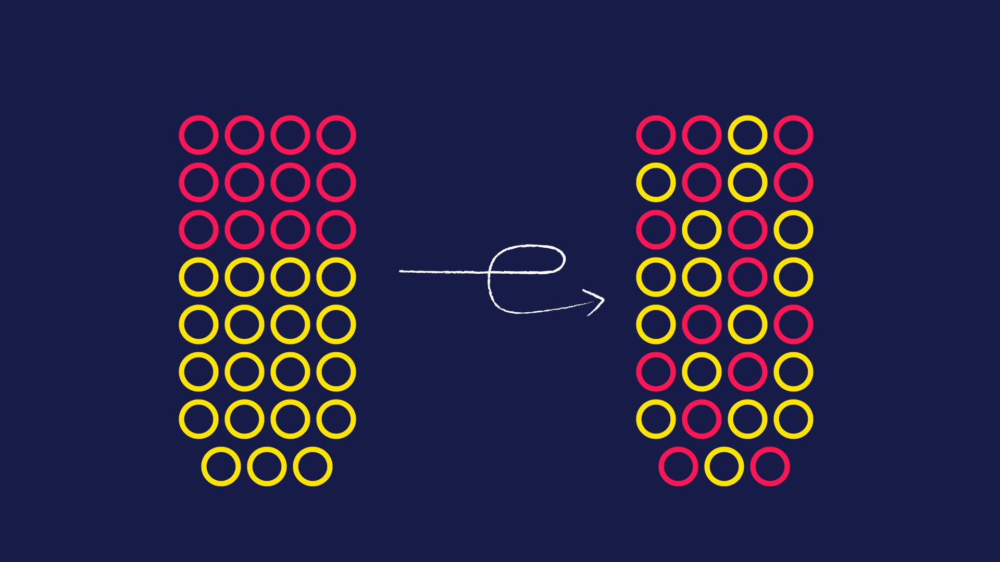

<h1 align="center">
Entropy of an Image
</h1>

# About the Project

In information systems entropy is defined as the disorder or the randomness of data. The aim of the project is to find the entropy of an image and map 10 dominant colours in that image.

## Technologies
* Python

## Versions
* Python 3.8
* Pycharm 2020.2.4
* pandas 1.1.4
* numpy 1.19.4
* sciKit-learn 0.23.2

## Setup
##### System Requirements
* 64 bit operating System
* 4gb RAM
* 250GB ROM (Optional)
* 1.06 GHz Processor (Minimum)

To run this project, install pycharm (the latest version) and setup the software. Install the above mentioned python packages.
* To install a python package go to terminal and type the command " pip install package_name "
